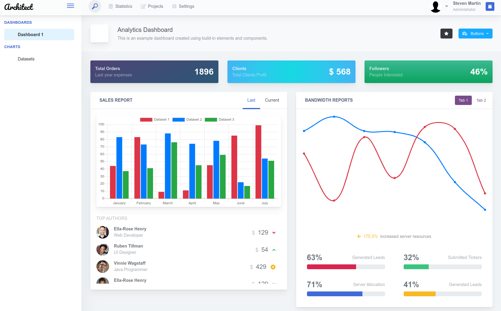

# Teleport Application Access Sample Tomcat Application

This sample application populates a session object and displays the user and role
name  on the header from the Teleport JSON Web Token (JWT). If the role given in
the JWT does not match to a configured valid role the user is shown an error page.
The user is shown as anonymous if no JWT is in the header and not in test mode.
**Note** this is not a production example or representative of how to authenticate
a user using JWT.  This sample is helpful to validate the username and roles are
populating and available to the respective application.

Example screenshot with user name and role in upper right.


## Configuring

See the `sampleaap.properties` file.  That file is populated to the /etc/ directory
in the docker image.

### Running in test mode
You can test various JWT tokens by setting testmode to `true`.  In that case it
will use the `testJWTToken` and ignore if there is a jwttoken.

### Setting valid roles
If the jwt token is present (test mode include) the application will validate against
the comma delimited list of `validRoles`.  If not the user will be directed to
the error page.

### Populating user names and role names
The role names uses a `_rolename` postfix and the user names uses a `_name` postfix.
Populate that with your expected roles, usernames or it will display the userid/roleid
(jeff/admin vs Jeffery Smith/Administrator).


## Building the Docker image

```bash
docker build --tag tomcataap:1.0 .
```
## Running the application

Exposing the application on port 8888 on the host machine.
```bash
docker run -d -p 8888:8080 --name tomcataapsample tomcataap:1.0
```

Check the application is running by visiting http://localhost:8888/sampleaap

## Teleport Application Access Settings

In this example the Tomcat app is running on the same machine as the Teleport
Application Access service.  You may have to use a different hostname to access
the tomcat app on its Docker service.

```yaml
app_service:
   enabled: yes
   apps:
   - name: "sample"
     uri: "http://localhost:8888/sampleaap"
```

## Changing Demo Java application

The source is provided under the `eclipseproject` dir and can be built and deployed
to a WAR file through Eclipse.
